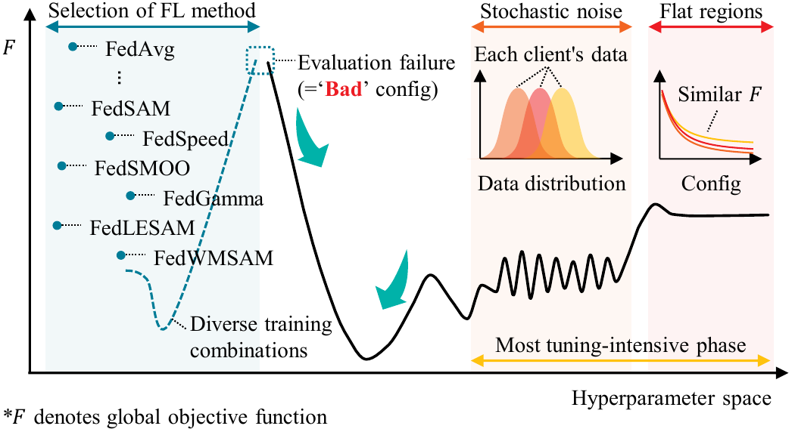
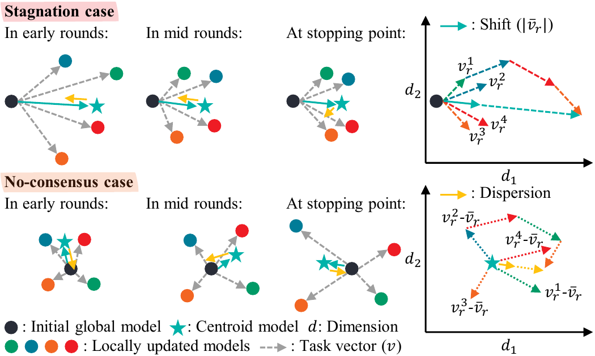

# Data-Free Early Stopping for Federated Learning with Consensus of Local Task Vectors

<div align="center">

[](https://arxiv.org/abs/TODO)
[](LICENSE)

**Youngjoon Lee<sup>1</sup>, Hyukjoon Lee<sup>2</sup>, Seungrok Jung<sup>2</sup>, Andy Luo<sup>2</sup>, Jinu Gong<sup>3</sup>, Yang Cao<sup>4</sup>, and Joonhyuk Kang<sup>1</sup>**

<sup>1</sup>School of Electrical Engineering, KAIST, South Korea  
<sup>2</sup>AI Group, AMD, United States  
<sup>3</sup>Department of Applied AI, Hansung University, South Korea  
<sup>4</sup>Department of Computer Science, Institute of Science Tokyo, Japan  

Contact: yjlee22@kaist.ac.kr

</div>

---

### Motivation

<div align="center">
  
</div>

<em>Fig. 1. Illustration of resource inefficiency in FL hyperparameter tuning. Since standard FL protocols use a fixed number of global rounds, 'bad' configurations waste computational and communication resources. This motivates the need for early stopping in FL for scalable and practical deployment.</em>

<br>

Federated Learning (FL) enables privacy-preserving collaborative training without transmitting raw data. However, existing FL methods rely on a **pre-defined fixed number of global rounds**, leading to significant waste when hyperparameter configurations fail to converge. Moreover, conventional early stopping requires **validation data at the server**, which violates the core FL privacy principle.

### Key Highlights

- **Data-free early stopping framework** that leverages consensus of local task vectors
- **Plug-and-play** compatibility with 10 state-of-the-art FL methods
- Screens bad configurations within **1.8% of the fixed-round budget** on average

---

## Method

<div align="center">
  
</div>

<em>Fig. 2. Illustration of the proposed data-free early stopping approach under 'bad' configurations. Shift and dispersion are illustrated at the stopping point for each case (stagnation and no-consensus).</em>

<br>

The core intuition leverages the **task vector concept**: the proposed framework monitors the consensus of local task vectors at the server to detect when a 'bad' configuration has stagnated or diverged, without accessing any validation data.

At each global round $r$, the **local task vector** of the $m$-th client is defined as:

```math
\mathbf{v}_r^m = \theta_r^m - \theta_0
```

The **centroid task vector** captures the consensus direction of local updates:

```math
\bar{\mathbf{v}}_r = \frac{1}{M} \sum_{m=1}^{M} \mathbf{v}_r^m
```

We define two quantities from the local task vectors:

- **Shift** — overall training progress:
```math
\text{shift}_r = \|\bar{\mathbf{v}}_r\|_2
```
- **Dispersion** — client-level disagreement:
```math
\text{disp}_r = \frac{1}{M} \sum_{m=1}^{M} \|\mathbf{v}_r^m - \bar{\mathbf{v}}_r\|_2
```

A **composite statistic** jointly captures both training progress and client-level disagreement:

```math
\phi_r = \text{shift}_r \times \left(1 + \frac{\text{disp}_r}{\text{shift}_r + \epsilon}\right)
```

To reduce noise, an **exponential moving average (EMA)** is applied with $\alpha = \frac{2}{\rho + 1}$:

```math
\tilde{\phi}_r = \alpha \phi_r + (1 - \alpha)\tilde{\phi}_{r-1}
```

Training is halted when the **relative change** of the smoothed statistic falls below threshold $\tau$ for $\rho$ consecutive rounds:

```math
\Delta_r = \frac{|\tilde{\phi}_r - \tilde{\phi}_{r-1}|}{|\tilde{\phi}_{r-1}| + \epsilon}, \qquad r^* = \min\{r \mid \kappa_r \geq \rho\}
```

The framework requires **only two hyperparameters** ($\tau$, $\rho$) and operates entirely on server-side local model parameters, making it fully compatible with the FL model-only transmission paradigm.

---

## Supported FL Methods

| # | Method | Category | Reference |
|:---:|:---|:---:|:---|
| 1 | **FedAvg** | SGD-basis | [McMahan et al., AISTATS 2017](http://proceedings.mlr.press/v54/mcmahan17a/mcmahan17a.pdf) |
| 2 | **FedProx** | SGD-basis | [Li et al., MLSys 2020](https://arxiv.org/abs/1812.06127) |
| 3 | **FedDyn** | SGD-basis | [Acar et al., ICLR 2021](https://openreview.net/pdf?id=B7v4QMR6Z9w) |
| 4 | **SCAFFOLD** | SGD-basis | [Karimireddy et al., ICML 2020](https://arxiv.org/abs/1910.06378) |
| 5 | **FedSAM** | SAM-basis | [Qu et al., ICML 2022](https://proceedings.mlr.press/v162/qu22a/qu22a.pdf) |
| 6 | **FedSpeed** | SAM-basis | [Sun et al., ICLR 2023](https://openreview.net/pdf?id=bZjxxYURKT) |
| 7 | **FedSMOO** | SAM-basis | [Sun et al., ICML 2023](https://proceedings.mlr.press/v202/sun23h.html) |
| 8 | **FedGamma** | SAM-basis | [Dai et al., TNNLS 2024](https://ieeexplore.ieee.org/abstract/document/10269141) |
| 9 | **FedLESAM** | SAM-basis | [Fan et al., ICML 2024](https://arxiv.org/abs/2405.18890) |
| 10 | **FedWMSAM** | SAM-basis | [Li et al., NeurIPS 2025](https://arxiv.org/abs/2511.22080) |

---

## Getting Started

### Requirements

Pull the Docker image:

```bash
docker pull rocm/pytorch:rocm7.2_ubuntu24.04_py3.12_pytorch_release_2.7.1
```

Install additional dependencies:

```bash
pip install tqdm timm medmnist
```

### Repository Structure

```
.
├── train.py              # Main training script
├── dataset.py            # Dataset loading and partitioning
├── utils.py              # Utility functions
├── method.py             # Proposed early stopping logic
├── client/               # Client-side FL method implementations
│   ├── fedavg.py
│   ├── fedprox.py
│   ├── feddyn.py
│   ├── scaffold.py
│   ├── fedsam.py
│   ├── fedspeed.py
│   ├── fedsmoo.py
│   ├── fedgamma.py
│   ├── fedlesam.py
│   └── fedwmsam.py
├── server/               # Server-side aggregation
├── optimizer/            # Custom optimizer implementations
├── run0.sh               # Proposed early stopping, varying patience
├── run1.sh               # Validation-based early stopping, varying patience
├── run2.sh               # Proposed early stopping, varying non-IID coefficient
├── run3.sh               # Validation-based early stopping, varying non-IID coefficient
├── result.py             # Plots Fig. 3 (patience comparison)
├── table.py              # Generates Table 1 (non-IID comparison)
└── figure/               # Paper figures
    ├── intro.png
    ├── problem.png
    ├── method.png
    └── result.png
```

### Datasets

The experiments use three medical imaging benchmarks from [MedMNIST v2](https://github.com/MedMNIST/MedMNIST):

| Dataset | Task | Classes | Source |
|---|---|---|---|
| **DermaMNIST** (Skin Lesion) | Multi-class classification | 7 | [HAM10000](https://www.nature.com/articles/sdata2018161) |
| **BloodMNIST** (Blood Cell) | Multi-class classification | 8 | [Acevedo et al., 2020](https://www.sciencedirect.com/science/article/pii/S2352340920303681) |
| **PathMNIST** (Colon Pathology) | Multi-class classification | 9 | [Kather et al., 2019](https://journals.plos.org/plosmedicine/article?id=10.1371/journal.pmed.1002730) |

The data will be automatically downloaded via the `medmnist` package. Datasets are partitioned across **N=100 clients** with **M=10** clients sampled per round under the Label skew (Dirichlet) non-IID setting.

---

## Running Experiments

All experiments use **ConvNeXtV2-Nano** as the local model with pretrained weights from `timm`, repeated with three random seeds (0, 1, 2).

> **Note**: The shell scripts use SLURM (`sbatch`) to submit jobs to an HPC cluster with AMD MI300X GPUs. Adjust the cluster configuration as needed for your environment.

### Experiment 1: Impact of Patience (ρ)

Reproduces Fig. 4 — comparison of early stopping points between the proposed and validation-based methods across 10 FL methods and patience values ρ ∈ {1, 2, 5, 10}.

```bash
bash run0.sh   # proposed early stopping
bash run1.sh   # validation-based early stopping
python result.py
```

### Experiment 2: Impact of Non-IID Degree (c)

Reproduces Table 1 — stopping rounds and usage ratios across 10 FL methods under different Dirichlet coefficients $c \in \{10^0, 10^{-1}, 10^{-2}, 10^{-3}\}$.

```bash
bash run2.sh   # proposed early stopping
bash run3.sh   # validation-based early stopping
python table.py
```

Outputs `table.tex` with LaTeX-formatted results showing stopping round and usage ratio (round / 500 × 100%) for each method and non-IID level.

---

### Training Arguments

| Category | Argument | Default | Description |
|:---:|:---|:---:|:---|
| **General** | `--method` | `FedAvg` | FL method to use |
| **General** | `--dataset` | `BloodMNIST` | Dataset (`BloodMNIST`, `DermaMNIST`, or `PathMNIST`) |
| **General** | `--num_class` | — | Number of classes for the dataset |
| **General** | `--seed` | `0` | Random seed |
| **FL Setup** | `--comm-rounds` | `500` | Maximum number of global rounds |
| **FL Setup** | `--total-client` | `100` | Total number of clients |
| **FL Setup** | `--active-ratio` | `0.1` | Fraction of clients sampled per round |
| **FL Setup** | `--local-epochs` | `5` | Number of local training epochs |
| **FL Setup** | `--local-learning-rate` | `0.1` | Local SGD learning rate |
| **Model** | `--pretrain` | `False` | Use pretrained ConvNeXtV2-Nano weights |
| **Early Stopping** | `--proposed` | `False` | Use proposed data-free early stopping |
| **Early Stopping** | `--validation` | `False` | Use validation-based early stopping |
| **Early Stopping** | `--threshold` | `0.1` | Stopping threshold $\tau$ |
| **Early Stopping** | `--patience` | `10` | Patience parameter $\rho$ |
| **Data Partitioning** | `--non-iid` | `False` | Enable non-IID partitioning |
| **Data Partitioning** | `--split-rule` | `Dirichlet` | Partitioning rule |
| **Data Partitioning** | `--split-coef` | `0.1` | Dirichlet coefficient $c$ |

**Example: Run proposed early stopping with FedSpeed on DermaMNIST**

```bash
python train.py \
  --proposed \
  --non-iid \
  --dataset DermaMNIST \
  --num_class 7 \
  --pretrain \
  --method FedSpeed \
  --seed 0 \
  --split-coef 0.1 \
  --threshold 0.1 \
  --patience 10 \
  --local-learning-rate 0.1
```

---

## Acknowledgements
This repository builds upon the FL simulator framework from [woodenchild95/FL-Simulator](https://github.com/woodenchild95/FL-Simulator).
